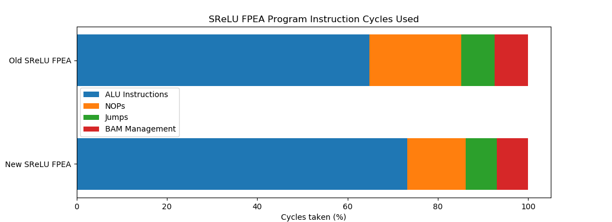
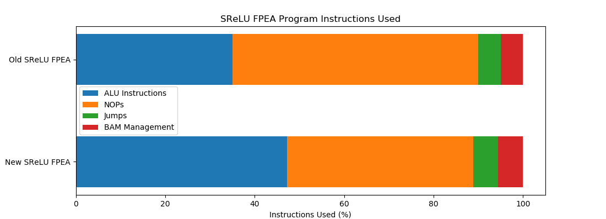
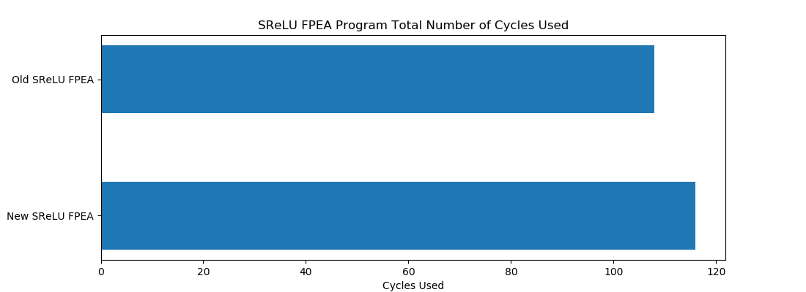
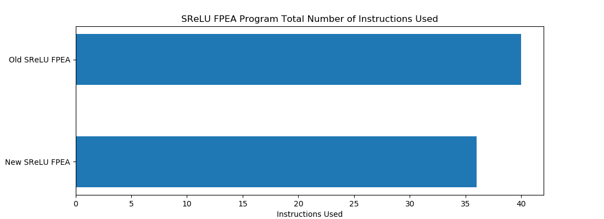
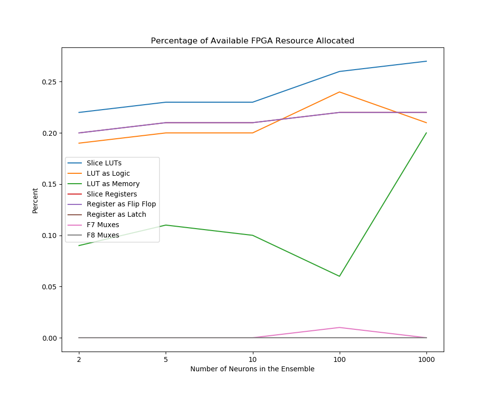

## The Goal

Between this version of the SReLU neuron FPEA program and the last changes were made to improve the overall program efficiency by reordering instructions in the assembly program as well as using the output from slice P on the DSP slice as an operand to instructions allowing the data to be used two cycles earlier in subsequent instructions than if the data was written to memory.

This work also establishes how resource cost grows when executing ensembles of SReLU neurons. The results of this can be found below in tables and plots.

## Git Commit

[f73740affa5b6f43ff1b973b36a4657130fe7855](https://gitlab.com/eStreams/sfpe/-/commit/f73740affa5b6f43ff1b973b36a4657130fe7855)

## FPEA Program Analysis

| Instruction | Used | Percentage (%) | Cycles Used | Cycles Used (%) |
| :-- | :--: | :--: | :--: | :--: |
| Total Number of Instructions | 36 |  | 116 |  |
| ALU Instructions | 17 | 47.222 | 85 | 73.276 |
| NOP | 15 | 41.667 | 15 | 12.931 |
| Jumps | 2 | 5.556 | 8 | 6.867 |
| BAM Management | 2 | 5.556 | 8 | 6.897 |

A new row has been added to the FPEA program analysis table for the "BAM management" instructions. These instructions include the RESET and SEEK instructions used to change the memory location referenced by the BAM address pointer.

This figure shows how the reordering of instructions and use of the P register as an operand has increased the percentage of cycles used by ALU instructions while reducing the percentage of NOP instructions.
From this we can see that the program efficiency is almost at 90%.

There is a reduction in the proportion of NOP instructions needed to stall the pipeline.

The new SReLU FPEA program uses more cycles than the old program because although there are less NOP instructions more ALU instructions were added to the program.

## FPGA Resource Utilization

## [Raw Data](./Raw-Data/)

## Future Work

The program efficiency has not reached 90% but it may be improved by interleaving the operations of different neurons into each iteration of the loop. However this may require adding more BAM resources or BAM management instructions, the latter would decrease program efficiency with BAM management overhead.
