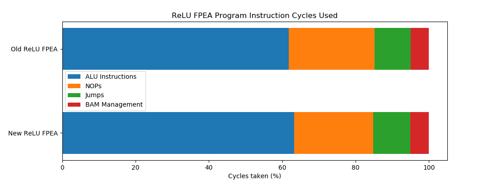
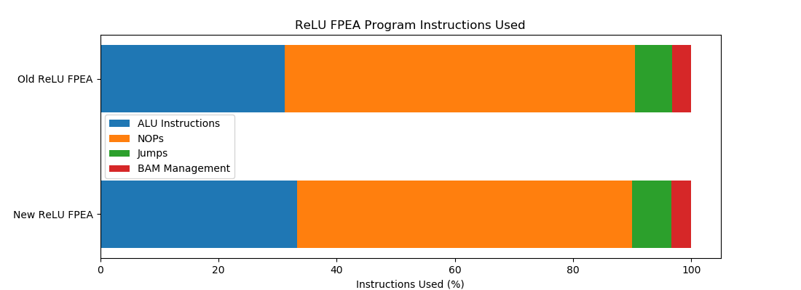
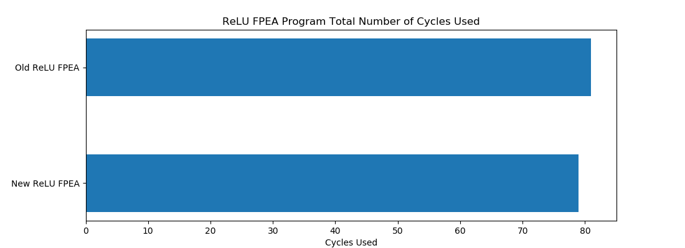
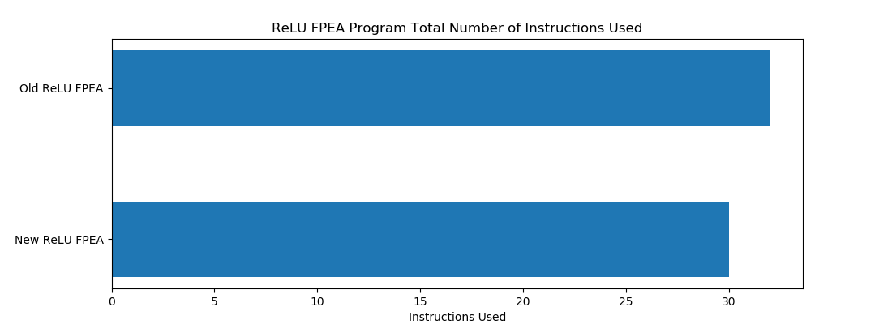
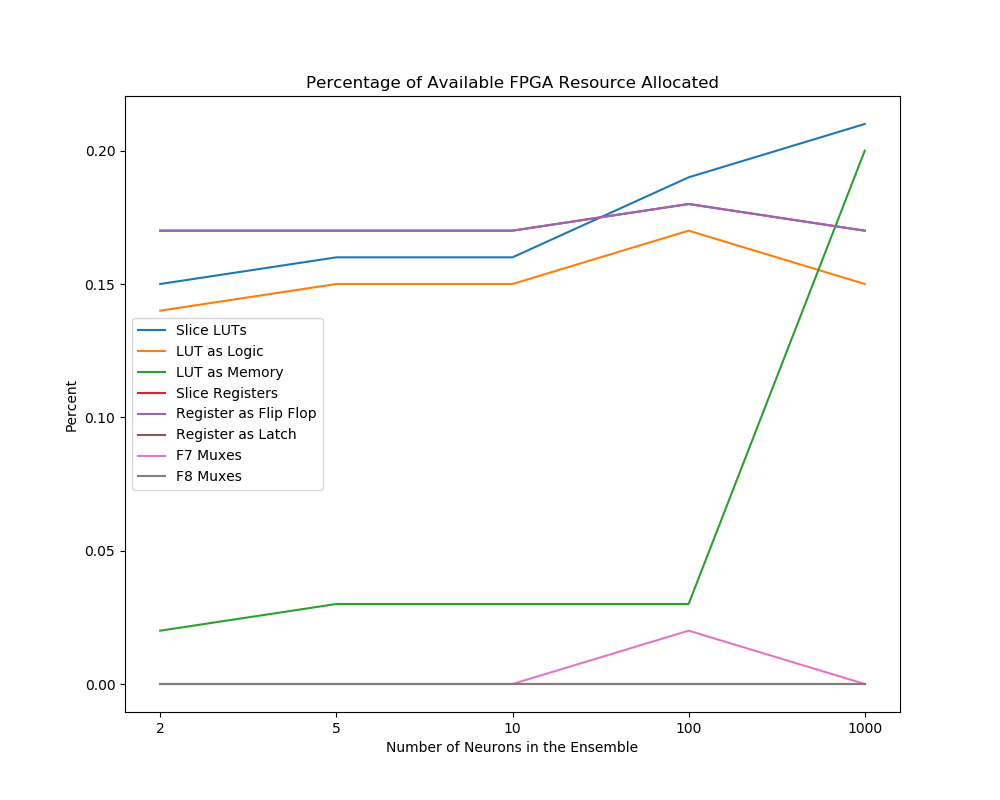

## The Goal

This work establishes how the resources allocated for the ReLU FPEA program on the FPGA changes when executing 2, 5, 10, 100 or 1000 neurons in an ensemble.

Between this version of the ReLU neuron FPEA program and the last changes were made to improve the overall program efficiency by reordering instructions in the assembly program as well as using the output from slice P on the DSP slice as an operand to instructions allowing the data to be used two cycles earlier in subsequent instructions than if the data was written to memory.

## Git Commit

[4f6f77648e77e952353c66531ef82019270aeab2](https://gitlab.com/eStreams/sfpe/-/commit/4f6f77648e77e952353c66531ef82019270aeab2)

## FPEA Program Analysis

| Instruction | Used | Percentage (%) | Cycles Used | Cycles Used (%) |
| :-- | :--: | :--: | :--: | :--: |
| Total Number of Instructions | 30 |  | 79 |  |
| ALU Instructions | 10 | 33.333 | 50 | 63.291 |
| NOP | 17 | 56.667 | 17 | 21.519 |
| Jumps | 2 | 6.667 | 8 | 10.127 |
| BAM Management | 1 | 3.333 | 4 | 5.063 |

By using the output from slice P of the DSP slice as an operand in instructions a small number of NOP instructions could be removed from the program however the combination of NOPs and jump instructions in the program still prevent the program efficiency from reaching 90%.

## 2 Neuron Ensemble Resource Utilization

### Slice Logic

|          Site Type         | Used | Fixed | Available | Util (%) |
| :-- | :--: | :--: | :--: | :--: |
| Slice LUTs                 |   80 |     0 |     53200 |  0.15 |
|   LUT as Logic             |   76 |     0 |     53200 |  0.14 |
|   LUT as Memory            |    4 |     0 |     17400 |  0.02 |
|     LUT as Distributed RAM |    0 |     0 |           |       |
|     LUT as Shift Register  |    4 |     0 |           |       |
| Slice Registers            |  177 |     0 |    106400 |  0.17 |
|   Register as Flip Flop    |  177 |     0 |    106400 |  0.17 |
|   Register as Latch        |    0 |     0 |    106400 |  0.00 |
| F7 Muxes                   |    0 |     0 |     26600 |  0.00 |
| F8 Muxes                   |    0 |     0 |     13300 |  0.00 |

### Memory

|    Site Type   | Used | Fixed | Available | Util (%) |
| :-- | :--: | :--: | :--: | :--: |
| Block RAM Tile |    0 |     0 |       140 |  0.00 |
|   RAMB36/FIFO* |    0 |     0 |       140 |  0.00 |
|   RAMB18       |    0 |     0 |       280 |  0.00 |

### DSP

|    Site Type   | Used | Fixed | Available | Util (%) |
| :-- | :--: | :--: | :--: | :--: |
| DSPs           |    1 |     0 |       220 |  0.45 |
|   DSP48E1 only |    1 |       |           |       |

## 5 Neuron Ensemble Resource Utilization

### Resource Utilization

#### Slice Logic

|          Site Type         | Used | Fixed | Available | Util (%) |
| :-- | :--: | :--: | :--: | :--: |
| Slice LUTs                 |   83 |     0 |     53200 |  0.16 |
|   LUT as Logic             |   78 |     0 |     53200 |  0.15 |
|   LUT as Memory            |    5 |     0 |     17400 |  0.03 |
|     LUT as Distributed RAM |    0 |     0 |           |       |
|     LUT as Shift Register  |    5 |     0 |           |       |
| Slice Registers            |  179 |     0 |    106400 |  0.17 |
|   Register as Flip Flop    |  179 |     0 |    106400 |  0.17 |
|   Register as Latch        |    0 |     0 |    106400 |  0.00 |
| F7 Muxes                   |    0 |     0 |     26600 |  0.00 |
| F8 Muxes                   |    0 |     0 |     13300 |  0.00 |

#### Memory

|    Site Type   | Used | Fixed | Available | Util (%) |
| :-- | :--: | :--: | :--: | :--: |
| Block RAM Tile |    0 |     0 |       140 |  0.00 |
|   RAMB36/FIFO* |    0 |     0 |       140 |  0.00 |
|   RAMB18       |    0 |     0 |       280 |  0.00 |

#### DSP

|    Site Type   | Used | Fixed | Available | Util (%) |
| :-- | :--: | :--: | :--: | :--: |
| DSPs           |    1 |     0 |       220 |  0.45 |
|   DSP48E1 only |    1 |       |           |       |

## 10 Neuron Ensemble Resource Utilization

#### Slice Logic

|          Site Type         | Used | Fixed | Available | Util (%) |
| :-- | :--: | :--: | :--: | :--: |
| Slice LUTs                 |   85 |     0 |     53200 |  0.16 |
|   LUT as Logic             |   79 |     0 |     53200 |  0.15 |
|   LUT as Memory            |    6 |     0 |     17400 |  0.03 |
|     LUT as Distributed RAM |    0 |     0 |           |       |
|     LUT as Shift Register  |    6 |     0 |           |       |
| Slice Registers            |  181 |     0 |    106400 |  0.17 |
|   Register as Flip Flop    |  181 |     0 |    106400 |  0.17 |
|   Register as Latch        |    0 |     0 |    106400 |  0.00 |
| F7 Muxes                   |    0 |     0 |     26600 |  0.00 |
| F8 Muxes                   |    0 |     0 |     13300 |  0.00 |

#### Memory

|    Site Type   | Used | Fixed | Available | Util (%) |
| :-- | :--: | :--: | :--: | :--: |
| Block RAM Tile |    0 |     0 |       140 |  0.00 |
|   RAMB36/FIFO* |    0 |     0 |       140 |  0.00 |
|   RAMB18       |    0 |     0 |       280 |  0.00 |

#### DSP

|    Site Type   | Used | Fixed | Available | Util (%) |
| :-- | :--: | :--: | :--: | :--: |
| DSPs           |    1 |     0 |       220 |  0.45 |
|   DSP48E1 only |    1 |       |           |       |

## 100 Neuron Ensemble Resource Utilization

#### Slice Logic

|          Site Type         | Used | Fixed | Available | Util (%) |
| :-- | :--: | :--: | :--: | :--: |
| Slice LUTs                 |   99 |     0 |     53200 |  0.19 |
|   LUT as Logic             |   93 |     0 |     53200 |  0.17 |
|   LUT as Memory            |    6 |     0 |     17400 |  0.03 |
|     LUT as Distributed RAM |    0 |     0 |           |       |
|     LUT as Shift Register  |    6 |     0 |           |       |
| Slice Registers            |  189 |     0 |    106400 |  0.18 |
|   Register as Flip Flop    |  189 |     0 |    106400 |  0.18 |
|   Register as Latch        |    0 |     0 |    106400 |  0.00 |
| F7 Muxes                   |    6 |     0 |     26600 |  0.02 |
| F8 Muxes                   |    0 |     0 |     13300 |  0.00 |

#### Memory

|    Site Type   | Used | Fixed | Available | Util (%) |
| :-- | :--: | :--: | :--: | :--: |
| Block RAM Tile |    0 |     0 |       140 |  0.00 |
|   RAMB36/FIFO* |    0 |     0 |       140 |  0.00 |
|   RAMB18       |    0 |     0 |       280 |  0.00 |

#### DSP

|    Site Type   | Used | Fixed | Available | Util (%) |
| :-- | :--: | :--: | :--: | :--: |
| DSPs           |    1 |     0 |       220 |  0.45 |
|   DSP48E1 only |    1 |       |           |       |

## 1000 Neuron Ensemble Resource Utilization

#### Slice Logic

|          Site Type         | Used | Fixed | Available | Util (%) |
| :-- | :--: | :--: | :--: | :--: |
| Slice LUTs                 |  114 |     0 |     53200 |  0.21 |
|   LUT as Logic             |   79 |     0 |     53200 |  0.15 |
|   LUT as Memory            |   35 |     0 |     17400 |  0.20 |
|     LUT as Distributed RAM |    0 |     0 |           |       |
|     LUT as Shift Register  |   35 |     0 |           |       |
| Slice Registers            |  181 |     0 |    106400 |  0.17 |
|   Register as Flip Flop    |  181 |     0 |    106400 |  0.17 |
|   Register as Latch        |    0 |     0 |    106400 |  0.00 |
| F7 Muxes                   |    0 |     0 |     26600 |  0.00 |
| F8 Muxes                   |    0 |     0 |     13300 |  0.00 |

#### Memory

|    Site Type   | Used | Fixed | Available | Util (%) |
| :-- | :--: | :--: | :--: | :--: |
| Block RAM Tile    |  0.5 |     0 |       140 |  0.36 |
|   RAMB36/FIFO*    |    0 |     0 |       140 |  0.00 |
|   RAMB18          |    1 |     0 |       280 |  0.36 |
|     RAMB18E1 only |    1 |       |           |       |

#### DSP

|    Site Type   | Used | Fixed | Available | Util (%) |
| :-- | :--: | :--: | :--: | :--: |
| DSPs           |    1 |     0 |       220 |  0.45 |
|   DSP48E1 only |    1 |       |           |       |

## FPGA Resource Utilization

## Future Work

Another way to further improve program efficiency would be to interleave the operations of other ReLU into the loop thus replacing NOP instructions with ALU instructions using data of other neurons in the ensemble. At this point it is not clear what this would impact in terms of resource usage or in the addition of BAM management instructions (which would reduce the program efficiency).
