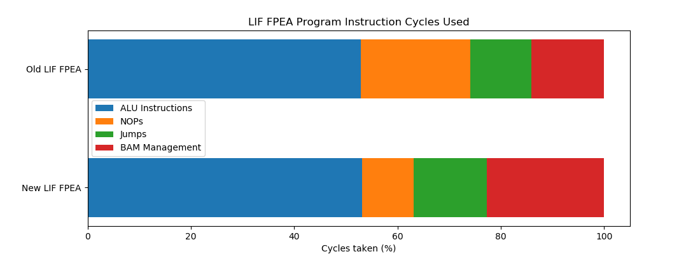
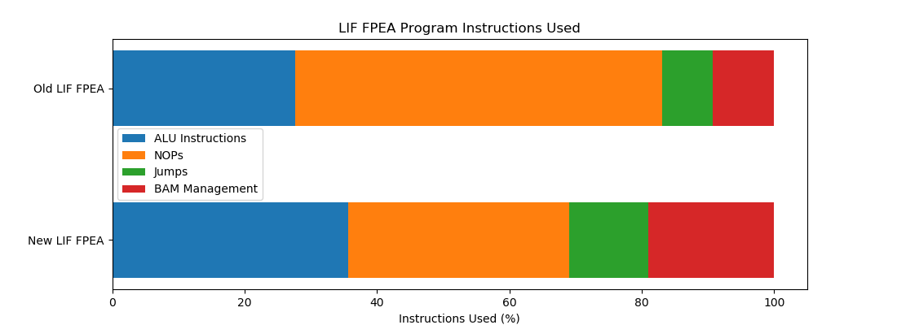
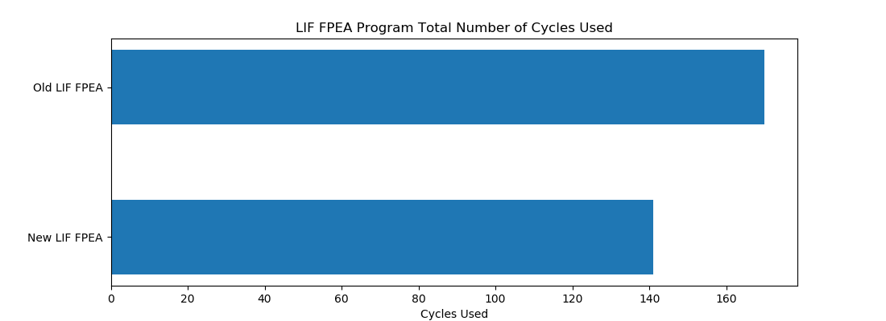
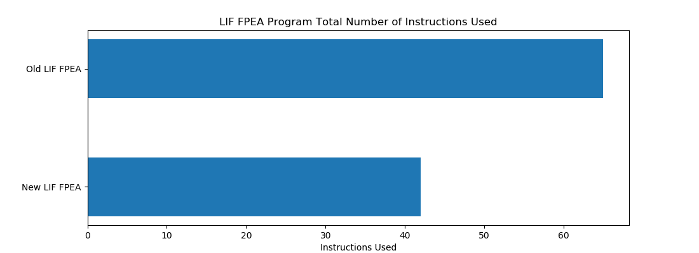
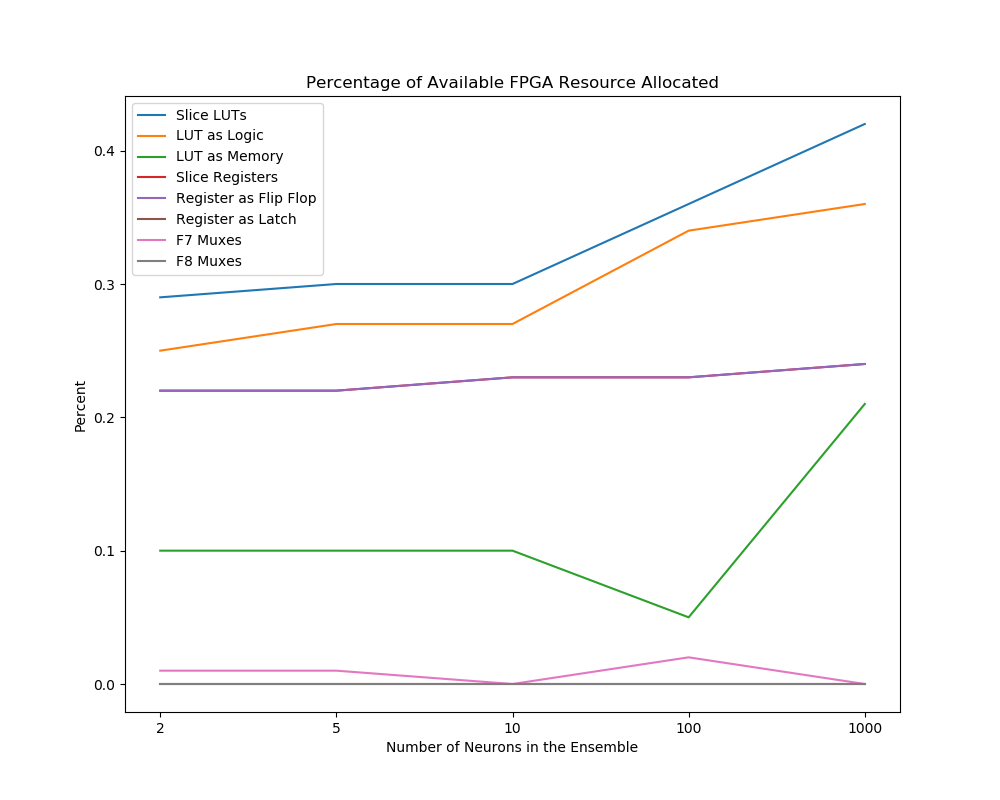

## The Goals

This work establishes how the resources allocated for the LIF FPEA program on the FPGA changes when executing 2, 5, 10, 100 or 1000 neurons in an ensemble.

Between this version of the LIF neuron FPEA program and the last changes were made to improve the overall program efficiency by reordering instructions in the assembly program as well as using the output from slice P on the DSP slice as an operand to instructions allowing the data to be used two cycles earlier in subsequent instructions than if the data was written to memory.

## Git Commit

[61451d9872f83a337e81aa7edc25e91d631f1e02](https://gitlab.com/eStreams/sfpe/-/commit/61451d9872f83a337e81aa7edc25e91d631f1e02)

## FPEA Program Analysis

| Instruction | Used | Percentage (%) | Cycles Used | Cycles Used (%) |
| :-- | :--: | :--: | :--: | :--: |
| Total Number of Instructions | 42 |  | 141 |  |
| ALU Instructions | 15 | 35.714 | 75 | 53.191 |
| NOP | 14 | 33.333 | 14 | 9.929 |
| Jumps | 5 | 11.905 | 20 | 14.184 |
| BAM Management | 8 | 19.048 | 32 | 22.695 |

As can be seen in the plot above the percentage of cycles used for NOP instructions has been reduced through the reordering of instructions and use of slice P as an operand to instructions.
We can also see however that 22% of the cycles ar used for BAM management, though it should be noted not all of these BAM management instructions will be executed and the ones that will depend on the path taken through the program.

## 2 Neuron Ensemble Resource Utilization

### Slice Logic

|          Site Type         | Used | Fixed | Available | Util (%) |
| :-- | :--: | :--: | :--: | :--: |
| Slice LUTs                 |  152 |     0 |     53200 |  0.29 |
|   LUT as Logic             |  135 |     0 |     53200 |  0.25 |
|   LUT as Memory            |   17 |     0 |     17400 |  0.10 |
|     LUT as Distributed RAM |   12 |     0 |           |       |
|     LUT as Shift Register  |    5 |     0 |           |       |
| Slice Registers            |  230 |     0 |    106400 |  0.22 |
|   Register as Flip Flop    |  230 |     0 |    106400 |  0.22 |
|   Register as Latch        |    0 |     0 |    106400 |  0.00 |
| F7 Muxes                   |    1 |     0 |     26600 | <0.01 |
| F8 Muxes                   |    0 |     0 |     13300 |  0.00 |

### Memory

|    Site Type   | Used | Fixed | Available | Util (%) |
| :-- | :--: | :--: | :--: | :--: |
| Block RAM Tile |    0 |     0 |       140 |  0.00 |
|   RAMB36/FIFO* |    0 |     0 |       140 |  0.00 |
|   RAMB18       |    0 |     0 |       280 |  0.00 |

### DSP

|    Site Type   | Used | Fixed | Available | Util (%) |
| :-- | :--: | :--: | :--: | :--: |
| DSPs           |    1 |     0 |       220 |  0.45 |
|   DSP48E1 only |    1 |       |           |       |

## 5 Neuron Ensemble Resource Utilization

### Resource Utilization

#### Slice Logic

|          Site Type         | Used | Fixed | Available | Util (%) |
| :-- | :--: | :--: | :--: | :--: |
| Slice LUTs                 |  158 |     0 |     53200 |  0.30 |
|   LUT as Logic             |  141 |     0 |     53200 |  0.27 |
|   LUT as Memory            |   17 |     0 |     17400 |  0.10 |
|     LUT as Distributed RAM |   12 |     0 |           |       |
|     LUT as Shift Register  |    5 |     0 |           |       |
| Slice Registers            |  236 |     0 |    106400 |  0.22 |
|   Register as Flip Flop    |  236 |     0 |    106400 |  0.22 |
|   Register as Latch        |    0 |     0 |    106400 |  0.00 |
| F7 Muxes                   |    1 |     0 |     26600 | <0.01 |
| F8 Muxes                   |    0 |     0 |     13300 |  0.00 |

#### Memory

|    Site Type   | Used | Fixed | Available | Util (%) |
| :-- | :--: | :--: | :--: | :--: |
| Block RAM Tile |    0 |     0 |       140 |  0.00 |
|   RAMB36/FIFO* |    0 |     0 |       140 |  0.00 |
|   RAMB18       |    0 |     0 |       280 |  0.00 |

#### DSP

|    Site Type   | Used | Fixed | Available | Util (%) |
| :-- | :--: | :--: | :--: | :--: |
| DSPs           |    1 |     0 |       220 |  0.45 |
|   DSP48E1 only |    1 |       |           |       |

## 10 Neuron Ensemble Resource Utilization

#### Slice Logic

|          Site Type         | Used | Fixed | Available | Util (%) |
| :-- | :--: | :--: | :--: | :--: |
| Slice LUTs                 |  162 |     0 |     53200 |  0.30 |
|   LUT as Logic             |  145 |     0 |     53200 |  0.27 |
|   LUT as Memory            |   17 |     0 |     17400 |  0.10 |
|     LUT as Distributed RAM |   12 |     0 |           |       |
|     LUT as Shift Register  |    5 |     0 |           |       |
| Slice Registers            |  242 |     0 |    106400 |  0.23 |
|   Register as Flip Flop    |  242 |     0 |    106400 |  0.23 |
|   Register as Latch        |    0 |     0 |    106400 |  0.00 |
| F7 Muxes                   |    0 |     0 |     26600 |  0.00 |
| F8 Muxes                   |    0 |     0 |     13300 |  0.00 |

#### Memory

|    Site Type   | Used | Fixed | Available | Util (%) |
| :-- | :--: | :--: | :--: | :--: |
| Block RAM Tile |    0 |     0 |       140 |  0.00 |
|   RAMB36/FIFO* |    0 |     0 |       140 |  0.00 |
|   RAMB18       |    0 |     0 |       280 |  0.00 |

#### DSP

|    Site Type   | Used | Fixed | Available | Util (%) |
| :-- | :--: | :--: | :--: | :--: |
| DSPs           |    1 |     0 |       220 |  0.45 |
|   DSP48E1 only |    1 |       |           |       |

## 100 Neuron Ensemble Resource Utilization

#### Slice Logic

|          Site Type         | Used | Fixed | Available | Util (%) |
| :-- | :--: | :--: | :--: | :--: |
| Slice LUTs                 |  191 |     0 |     53200 |  0.36 |
|   LUT as Logic             |  183 |     0 |     53200 |  0.34 |
|   LUT as Memory            |    8 |     0 |     17400 |  0.05 |
|     LUT as Distributed RAM |    0 |     0 |           |       |
|     LUT as Shift Register  |    8 |     0 |           |       |
| Slice Registers            |  250 |     0 |    106400 |  0.23 |
|   Register as Flip Flop    |  250 |     0 |    106400 |  0.23 |
|   Register as Latch        |    0 |     0 |    106400 |  0.00 |
| F7 Muxes                   |    6 |     0 |     26600 |  0.02 |
| F8 Muxes                   |    0 |     0 |     13300 |  0.00 |

#### Memory

|    Site Type   | Used | Fixed | Available | Util (%) |
| :-- | :--: | :--: | :--: | :--: |
| Block RAM Tile    |  0.5 |     0 |       140 |  0.36 |
|   RAMB36/FIFO*    |    0 |     0 |       140 |  0.00 |
|   RAMB18          |    1 |     0 |       280 |  0.36 |
|     RAMB18E1 only |    1 |       |           |       |

#### DSP

|    Site Type   | Used | Fixed | Available | Util (%) |
| :-- | :--: | :--: | :--: | :--: |
| DSPs           |    1 |     0 |       220 |  0.45 |
|   DSP48E1 only |    1 |       |           |       |

## 1000 Neuron Ensemble Resource Utilization

#### Slice Logic

|          Site Type         | Used | Fixed | Available | Util (%) |
| :-- | :--: | :--: | :--: | :--: |
| Slice LUTs                 |  225 |     0 |     53200 |  0.42 |
|   LUT as Logic             |  189 |     0 |     53200 |  0.36 |
|   LUT as Memory            |   36 |     0 |     17400 |  0.21 |
|     LUT as Distributed RAM |    0 |     0 |           |       |
|     LUT as Shift Register  |   36 |     0 |           |       |
| Slice Registers            |  253 |     0 |    106400 |  0.24 |
|   Register as Flip Flop    |  253 |     0 |    106400 |  0.24 |
|   Register as Latch        |    0 |     0 |    106400 |  0.00 |
| F7 Muxes                   |    0 |     0 |     26600 |  0.00 |
| F8 Muxes                   |    0 |     0 |     13300 |  0.00 |

#### Memory

|    Site Type   | Used | Fixed | Available | Util (%) |
| :-- | :--: | :--: | :--: | :--: |
| Block RAM Tile    |  2.5 |     0 |       140 |  1.79 |
|   RAMB36/FIFO*    |    2 |     0 |       140 |  1.43 |
|     RAMB36E1 only |    2 |       |           |       |
|   RAMB18          |    1 |     0 |       280 |  0.36 |
|     RAMB18E1 only |    1 |       |           |       |

#### DSP

|    Site Type   | Used | Fixed | Available | Util (%) |
| :-- | :--: | :--: | :--: | :--: |
| DSPs           |    1 |     0 |       220 |  0.45 |
|   DSP48E1 only |    1 |       |           |       |

## FPGA Resource Utilization

## Future Work

Almost 40% of the cycles used to execute an ensemble of LIF neurons are used for jump instructions and BAM management.
This number could potentially be reduced by interleaving the execution of other neurons in the same ensemble. Additionally, instead of storing all the data of a particular neuron in one block in memory we could interleave the data of multiple neurons which may remove some or all of the BAM management instructions from the program.
