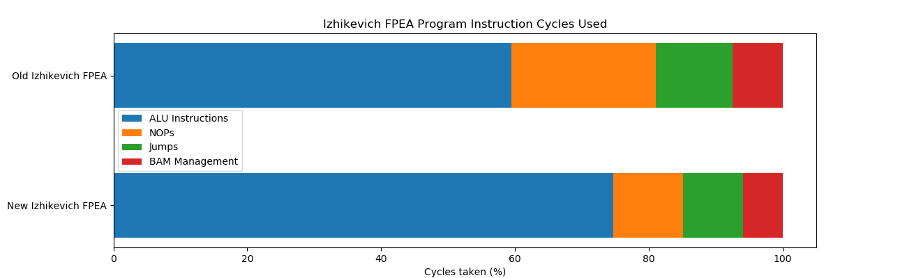
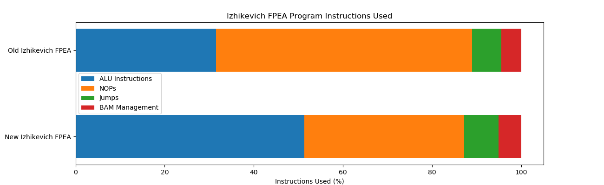
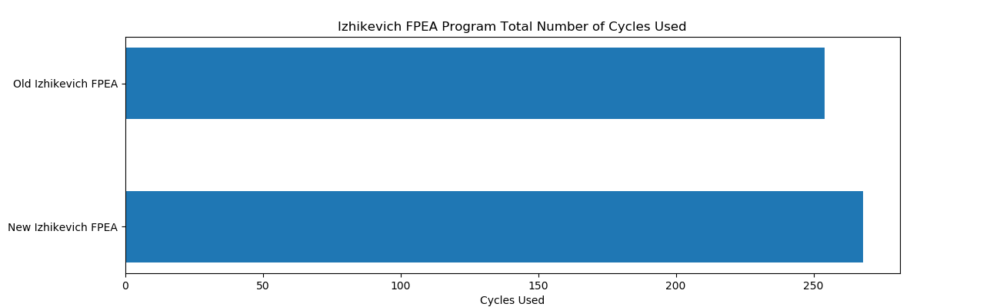
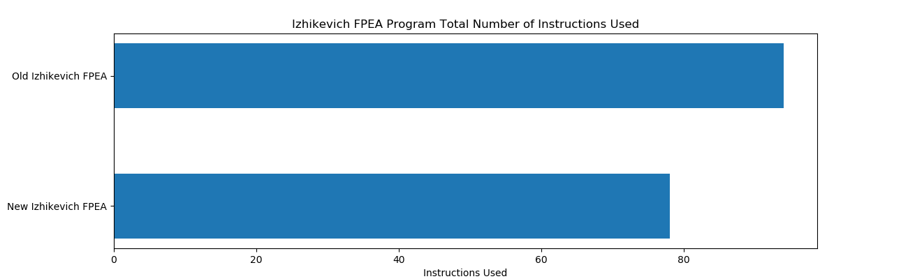
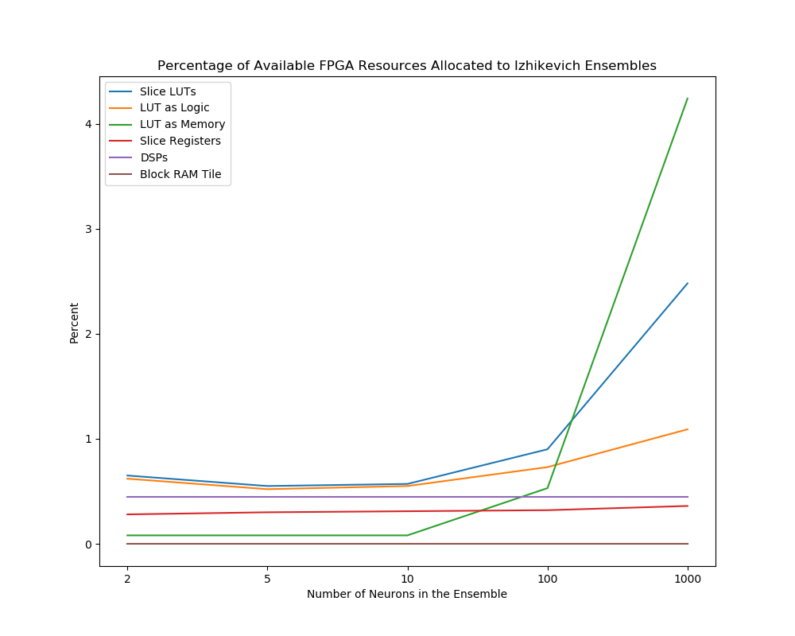

## The Goal

This work establishes how the resources allocated for the Izhikevich FPEA program on the FPGA changes when executing 2, 5, 10, 100 or 1000 neurons in an ensemble.

Between this version of the Izhikevich neuron FPEA program and the last changes were made to improve the overall program efficiency by reordering instructions in the assembly program as well as using the output from slice P on the DSP slice as an operand to instructions allowing the data to be used two cycles earlier in subsequent instructions than if the data was written to memory.

As well as the previously mentioned changes, the Izhikevich FPEA program was rewritten to use instructions found on the new version of the processor. This includes the use of bit shifting operations to truncate the results of the fixed-point multiplications.
The ALU data width specified in the parameters was also corrected to 32 bits to support the multiplication of 16 bit fixed-point values.

## Git Commit

[9890cb78bd0e6f3ae219ce09ef047f0e65909efa](https://gitlab.com/eStreams/sfpe/-/commit/9890cb78bd0e6f3ae219ce09ef047f0e65909efa)

## FPEA Program Analysis

| Instruction | Used | Percentage (%) | Cycles Used | Cycles Used (%) |
| :-- | :--: | :--: | :--: | :--: |
| Total Number of Instructions | 78 |  | 268 |  |
| ALU Instructions | 40 | 51.282 | 200 | 74.627 |
| NOPs | 28 | 35.897 | 29 | 10.448 |
| Jumps | 6 | 7.692 | 24 | 8.955 |
| BAM Management | 4 | 5.128 | 16 | 5.970 |

As can be seen in the plots above almost 80% of the processor cycles are executing ALU instructions despite 35% of the instructions in the program being NOPs.
It is possible to reduce the number of jumps in the program by 1/3 by including the addition of the after-spike reset recovery to the recovery variable in the same jumps as the resetting of the of the post-spike membrane potential, though how this may affect the size of data being handled has not yet been experimented with in out work.

By using the output from slice P of the DSP slice as an operand in instructions a number of NOP instructions could be removed from the program however the combination of NOPs and jump instructions in the program still prevent the program efficiency from reaching 90%.

## 2 Neuron Ensemble Resource Utilization

### Slice Logic

|          Site Type         | Used | Fixed | Available | Util (%) |
| :-- | :--: | :--: | :--: | :--: |
| Slice LUTs                 |  346 |     0 |     53200 |  0.65 |
|   LUT as Logic             |  332 |     0 |     53200 |  0.62 |
|   LUT as Memory            |   14 |     0 |     17400 |  0.08 |
|     LUT as Distributed RAM |   12 |     0 |           |       |
|     LUT as Shift Register  |    2 |     0 |           |       |
| Slice Registers            |  300 |     0 |    106400 |  0.28 |
|   Register as Flip Flop    |  267 |     0 |    106400 |  0.25 |
|   Register as Latch        |   33 |     0 |    106400 |  0.03 |
| F7 Muxes                   |    9 |     0 |     26600 |  0.03 |
| F8 Muxes                   |    0 |     0 |     13300 |  0.00 |

### Memory

|    Site Type   | Used | Fixed | Available | Util (%) |
| :-- | :--: | :--: | :--: | :--: |
| Block RAM Tile |    0 |     0 |       140 |  0.00 |
|   RAMB36/FIFO* |    0 |     0 |       140 |  0.00 |
|   RAMB18       |    0 |     0 |       280 |  0.00 |

### DSP

|    Site Type   | Used | Fixed | Available | Util (%) |
| :-- | :--: | :--: | :--: | :--: |
| DSPs           |    1 |     0 |       220 |  0.45 |
|   DSP48E1 only |    1 |       |           |       |

## 5 Neuron Ensemble Resource Utilization

### Resource Utilization

#### Slice Logic

|          Site Type         | Used | Fixed | Available | Util (%) |
| :-- | :--: | :--: | :--: | :--: |
| Slice LUTs                 |  292 |     0 |     53200 |  0.55 |
|   LUT as Logic             |  278 |     0 |     53200 |  0.52 |
|   LUT as Memory            |   14 |     0 |     17400 |  0.08 |
|     LUT as Distributed RAM |   12 |     0 |           |       |
|     LUT as Shift Register  |    2 |     0 |           |       |
| Slice Registers            |  323 |     0 |    106400 |  0.30 |
|   Register as Flip Flop    |  274 |     0 |    106400 |  0.26 |
|   Register as Latch        |   49 |     0 |    106400 |  0.05 |
| F7 Muxes                   |   10 |     0 |     26600 |  0.04 |
| F8 Muxes                   |    0 |     0 |     13300 |  0.00 |

#### Memory

|    Site Type   | Used | Fixed | Available | Util (%) |
| :-- | :--: | :--: | :--: | :--: |
| Block RAM Tile |    0 |     0 |       140 |  0.00 |
|   RAMB36/FIFO* |    0 |     0 |       140 |  0.00 |
|   RAMB18       |    0 |     0 |       280 |  0.00 |

#### DSP

|    Site Type   | Used | Fixed | Available | Util (%) |
| :-- | :--: | :--: | :--: | :--: |
| DSPs           |    1 |     0 |       220 |  0.45 |
|   DSP48E1 only |    1 |       |           |       |

## 10 Neuron Ensemble Resource Utilization

#### Slice Logic

|          Site Type         | Used | Fixed | Available | Util (%) |
| :-- | :--: | :--: | :--: | :--: |
| Slice LUTs                 |  304 |     0 |     53200 |  0.57 |
|   LUT as Logic             |  290 |     0 |     53200 |  0.55 |
|   LUT as Memory            |   14 |     0 |     17400 |  0.08 |
|     LUT as Distributed RAM |   12 |     0 |           |       |
|     LUT as Shift Register  |    2 |     0 |           |       |
| Slice Registers            |  327 |     0 |    106400 |  0.31 |
|   Register as Flip Flop    |  278 |     0 |    106400 |  0.26 |
|   Register as Latch        |   49 |     0 |    106400 |  0.05 |
| F7 Muxes                   |   10 |     0 |     26600 |  0.04 |
| F8 Muxes                   |    0 |     0 |     13300 |  0.00 |

#### Memory

|    Site Type   | Used | Fixed | Available | Util (%) |
| :-- | :--: | :--: | :--: | :--: |
| Block RAM Tile |    0 |     0 |       140 |  0.00 |
|   RAMB36/FIFO* |    0 |     0 |       140 |  0.00 |
|   RAMB18       |    0 |     0 |       280 |  0.00 |

#### DSP

|    Site Type   | Used | Fixed | Available | Util (%) |
| :-- | :--: | :--: | :--: | :--: |
| DSPs           |    1 |     0 |       220 |  0.45 |
|   DSP48E1 only |    1 |       |           |       |

## 100 Neuron Ensemble Resource Utilization

#### Slice Logic

|          Site Type         | Used | Fixed | Available | Util (%) |
| :-- | :--: | :--: | :--: | :--: |
| Slice LUTs                 |  479 |     0 |     53200 |  0.90 |
|   LUT as Logic             |  386 |     0 |     53200 |  0.73 |
|   LUT as Memory            |   93 |     0 |     17400 |  0.53 |
|     LUT as Distributed RAM |   88 |     0 |           |       |
|     LUT as Shift Register  |    5 |     0 |           |       |
| Slice Registers            |  340 |     0 |    106400 |  0.32 |
|   Register as Flip Flop    |  291 |     0 |    106400 |  0.27 |
|   Register as Latch        |   49 |     0 |    106400 |  0.05 |
| F7 Muxes                   |   18 |     0 |     26600 |  0.07 |
| F8 Muxes                   |    0 |     0 |     13300 |  0.00 |

#### Memory

|    Site Type   | Used | Fixed | Available | Util (%) |
| :-- | :--: | :--: | :--: | :--: |
| Block RAM Tile |    0 |     0 |       140 |  0.00 |
|   RAMB36/FIFO* |    0 |     0 |       140 |  0.00 |
|   RAMB18       |    0 |     0 |       280 |  0.00 |

#### DSP

|    Site Type   | Used | Fixed | Available | Util (%) |
| :-- | :--: | :--: | :--: | :--: |
| DSPs           |    1 |     0 |       220 |  0.45 |
|   DSP48E1 only |    1 |       |           |       |

## 1000 Neuron Ensemble Resource Utilization

#### Slice Logic

|          Site Type         | Used | Fixed | Available | Util (%) |
| :-- | :--: | :--: | :--: | :--: |
| Slice LUTs                 | 1317 |     0 |     53200 |  2.48 |
|   LUT as Logic             |  580 |     0 |     53200 |  1.09 |
|   LUT as Memory            |  737 |     0 |     17400 |  4.24 |
|     LUT as Distributed RAM |  704 |     0 |           |       |
|     LUT as Shift Register  |   33 |     0 |           |       |
| Slice Registers            |  383 |     0 |    106400 |  0.36 |
|   Register as Flip Flop    |  334 |     0 |    106400 |  0.31 |
|   Register as Latch        |   49 |     0 |    106400 |  0.05 |
| F7 Muxes                   |   80 |     0 |     26600 |  0.30 |
| F8 Muxes                   |    2 |     0 |     13300 |  0.02 |

#### Memory

|    Site Type   | Used | Fixed | Available | Util (%) |
| :-- | :--: | :--: | :--: | :--: |
| Block RAM Tile |    0 |     0 |       140 |  0.00 |
|   RAMB36/FIFO* |    0 |     0 |       140 |  0.00 |
|   RAMB18       |    0 |     0 |       280 |  0.00 |

#### DSP

|    Site Type   | Used | Fixed | Available | Util (%) |
| :-- | :--: | :--: | :--: | :--: |
| DSPs           |    1 |     0 |       220 |  0.45 |
|   DSP48E1 only |    1 |       |           |       |

## FPGA Resource Utilization

## Future Work

Another way to further improve program efficiency would be to interleave the operations of other Izhikevich into the loop thus replacing NOP instructions with ALU instructions using data of other neurons in the ensemble. At this point it is not clear what this would impact in terms of resource usage or in the addition of BAM management instructions (which would reduce the program efficiency).
