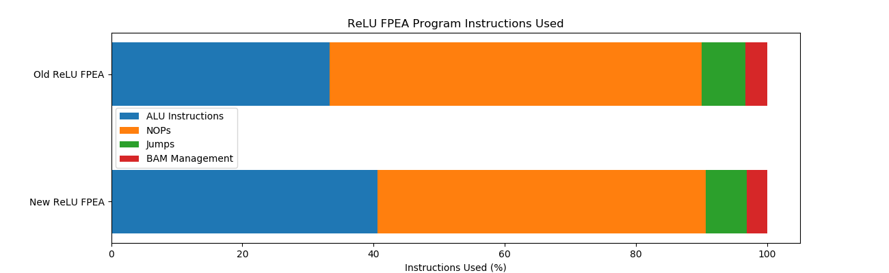
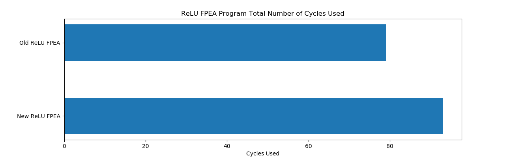
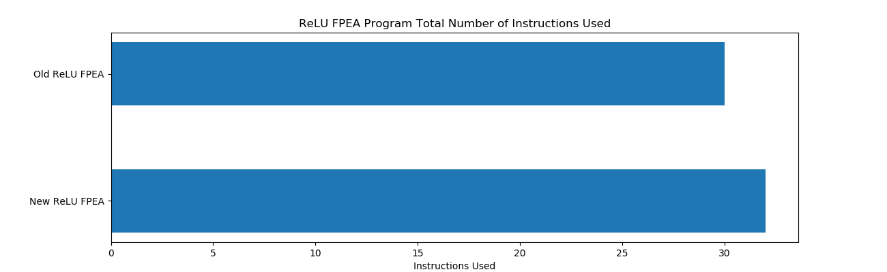
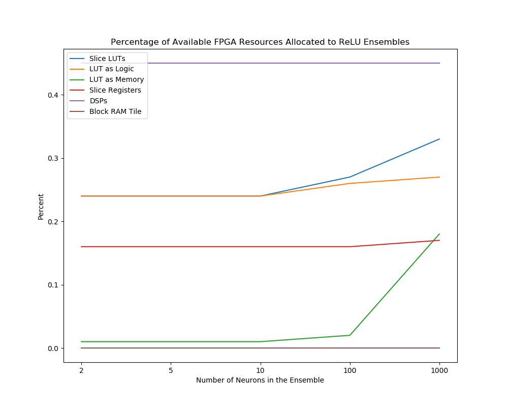

## The Goal

The ReLU FPEA program was rewritten to use instructions found on the new version of the processor. This includes the use of bit shifting operations to truncate the results of the fixed-point multiplications.
The ALU data width specified in the parameters was also corrected to 32 bits to support the multiplication of 16 bit fixed-point values.

## Git Commit

[d06cf18469abddba9b2dd6785fa37ade6f1b80e8](https://gitlab.com/eStreams/sfpe/-/commit/d06cf18469abddba9b2dd6785fa37ade6f1b80e8)

## FPEA Program Analysis

| Instruction | Used | Percentage (%) | Cycles Used | Cycles Used (%) |
| :-- | :--: | :--: | :--: | :--: |
| Total Number of Instructions | 32 |  | 93 |  |
| ALU Instructions | 13 | 40.625 | 65 | 69.892 |
| NOPs | 16 | 50.000 | 16 | 17.204 |
| Jumps | 2 | 6.250 | 8 | 8.602 |
| BAM Management | 1 | 3.125 | 4 | 4.301 |

The ReLU ensemble program is at almost 70% program efficiency. 50% of instructions are NOPs however this accounts for only 17% of processor cycles.

## Comparison of Slice Logic Used by Each Ensemble

|          Site Type         | 2 Neurons | 5 Neurons | 10 Neurons | 100 Neurons | 1000 Neurons |
| :-- | :--: | :--: | :--: | :--: | :--: |
| Slice LUTs                 |  129 |  129 |  129 |  142 |  177 |
|   LUT as Logic             |  128 |  128 |  128 |  138 |  145 |
|   LUT as Memory            |    1 |    1 |    1 |    4 |   32 |
|     LUT as Distributed RAM |    0 |    0 |    0 |    0 |    0 |
|     LUT as Shift Register  |    1 |    1 |    1 |    4 |   32 |
| Slice Registers            |  165 |  166 |  167 |  171 |  186 |
|   Register as Flip Flop    |  157 |  158 |  159 |  163 |  178 |
|   Register as Latch        |    8 |    8 |    8 |    8 |    8 |
| F7 Muxes                   |    0 |    0 |    0 |    3 |    0 |
| F8 Muxes                   |    0 |    0 |    0 |    0 |    0 |

## Comparison of Memory Used by Each Ensemble

|    Site Type   | 2 Neurons | 5 Neurons | 10 Neurons | 100 Neurons | 1000 Neurons |
| :-- | :--: | :--: | :--: | :--: | :--: |
| Block RAM Tile |    0 |    0 |    0 |    0 |    0 |
|   RAMB36/FIFO* |    0 |    0 |    0 |    0 |    0 |
|   RAMB18       |    0 |    0 |    0 |    0 |    0 |

## Comparison of DSPs Used by Each Ensemble

|    Site Type   | 2 Neurons | 5 Neurons | 10 Neurons | 100 Neurons | 1000 Neurons |
| :-- | :--: | :--: | :--: | :--: | :--: |
| DSPs           |    1 |    1 |    1 |    1 |    1 |
|   DSP48E1 only |    1 |    1 |    1 |    1 |    1 |

## FPGA Resource Utilization

## Future Work

To further improve program efficiency would be to interleave the operations of other ReLU into the loop thus replacing NOP instructions with ALU instructions using data of other neurons in the ensemble. At this point it is not clear what this would impact in terms of resource usage or in the addition of BAM management instructions (which would reduce the program efficiency).
