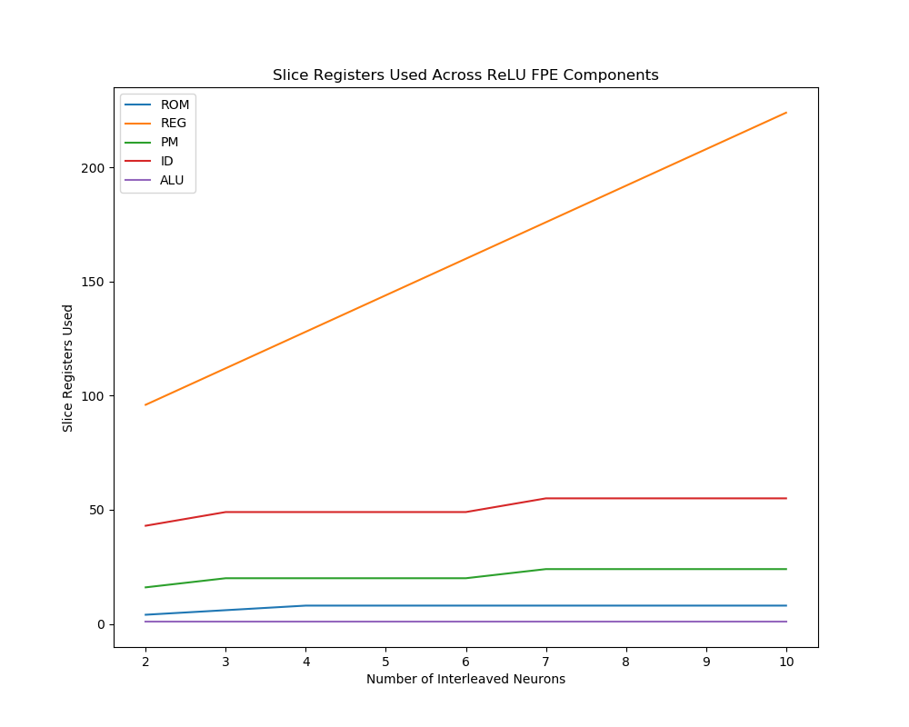

## The Goal

This work was conducted to observe how hardware resource cost changes when using RAM or registers (REG) to store intermediate data during the execution of interleaved ReLU neurons.
This would enable us to make a better informed decision about which memory to use for this purpose as the size of ensembles, and thus the number of neurons interleaved, increases.

The word size of the data used in gathering these results is 16 bits.

## Work Done

The work involved creating new ReLU neuron activiation function FPEA programs for executing ensembles of 2, 3, 4, 5, 6, 7, 8, 9 and 10 interleaved ReLU neurons as well as applying the ensemble scaled encoders, bias and decoder weights.

To interleave the execution of multiple neurons into one batch I have copied each instruction N times (where N is the number of interleaved neurons for that program). So an instruction is executed N times consecutively while acting on different data. The only exception to this is the MUL instructions as the truncation of the result must take place immediately after the multiply is executed to prevent any loss of data caused by storing the result temporarily in memories that may be too small.
Each interleaved neuron requires one RAM/ REG data memory for storing intermediate values.

## Conclusion

From the results shown we can see that using RAM to store intermediate values during the execution of the ReLU assembly program is much more efficient as it uses significantly less resources and the cost of implementing more interleaved neurons does not grow at the same rate as when using registers to store intermediate values.
Using registers as intermediate storage uses significantly more slice LUTs (specifically LUTs as logic) than when using RAM, whereas when using RAM as the number of neurons increases from 2 to 10 the required number of LUTs on the device only changes from 13 to 15 and these small changes do not take place in the RAM component.

After interleaving 3 neurons there are no NOP instructions within the activation function loop, however, 3 NOP instructions were added to the program outside the execution of the activation function loop. It still remains to find a way to remove these NOPs from the program.

## Future Work

This work is currently only applied to the ReLU neurons but could be extended to the SReLU, Izhikevich and LIF neurons.

Another step could be to implement a means by which to generate the neuron ensemble code automatically so that it becomes more feasible to generate the same set of results but for much larger ensemble sizes.

## Git Commit

[1aed36860e01f70a1ab63b3137457e86265ff410](https://gitlab.com/eStreams/sfpe/-/commit/1aed36860e01f70a1ab63b3137457e86265ff410)

## Comparison of Slice LUTs Used

Slice LUTs is the sum of the "LUTs as Logic" and "LUTs as Memory".

## Comparison of LUTs as Logic Used

## Comparison of LUTs as Memory Used

When using RAM to store intermediate values more LUTs are needed as memory, it appears that when the number of interleaved neurons increases by 4 another LUT is needed to store the intermediate data.

## Comparison of Slice Registers Used

## Comparison of Block RAM Tiles Used

## Hardware Resource Cost Comparison of For Each Interleaved Neuron Ensemble

### Hardware Resource Cost for 2 Interleaved ReLU Neurons

|          Site Type         | RAM | REG |
| :-- | :--: | :--: |
| Slice LUTs                 |  197 |  157 |
|   LUT as Logic             |  184 |  156 |
|   LUT as Memory            |   13 |    1 |
| Slice Registers            |  181 |  214 |

### Hardware Resource Cost for 3 Interleaved ReLU Neurons

|          Site Type         | RAM | REG |
| :-- | :--: | :--: |
| Slice LUTs                 |  210 |  190 |
|   LUT as Logic             |  197 |  189 |
|   LUT as Memory            |   13 |    1 |
| Slice Registers            |  202 |  244 |

### Hardware Resource Cost for 4 Interleaved ReLU Neurons

|          Site Type         | RAM | REG |
| :-- | :--: | :--: |
| Slice LUTs                 |  208 |  212 |
|   LUT as Logic             |  195 |  211 |
|   LUT as Memory            |   13 |    1 |
| Slice Registers            |  186 |  262 |

### Hardware Resource Cost for 5 Interleaved ReLU Neurons

|          Site Type         | RAM | REG |
| :-- | :--: | :--: |
| Slice LUTs                 |  211 |  213 |
|   LUT as Logic             |  197 |  212 |
|   LUT as Memory            |   14 |    1 |
| Slice Registers            |  209 |  278 |

### Hardware Resource Cost for 6 Interleaved ReLU Neurons

|          Site Type         | RAM | REG |
| :-- | :--: | :--: |
| Slice LUTs                 |  212 |  211 |
|   LUT as Logic             |  198 |  210 |
|   LUT as Memory            |   14 |    1 |
| Slice Registers            |  209 |  295 |

### Hardware Resource Cost for 7 Interleaved ReLU Neurons

|          Site Type         | RAM | REG |
| :-- | :--: | :--: |
| Slice LUTs                 |  215 |  242 |
|   LUT as Logic             |  201 |  241 |
|   LUT as Memory            |   14 |    1 |
| Slice Registers            |  210 |  322 |

### Hardware Resource Cost for 8 Interleaved ReLU Neurons

|          Site Type         | RAM | REG |
| :-- | :--: | :--: |
| Slice LUTs                 |  210 |  244 |
|   LUT as Logic             |  196 |  243 |
|   LUT as Memory            |   14 |    1 |
| Slice Registers            |  194 |  338 |

### Hardware Resource Cost for 9 Interleaved ReLU Neurons

|          Site Type         | RAM | REG |
| :-- | :--: | :--: |
| Slice LUTs                 |  216 |  285 |
|   LUT as Logic             |  201 |  284 |
|   LUT as Memory            |   15 |    1 |
| Slice Registers            |  217 |  354 |

### Hardware Resource Cost for 10 Interleaved ReLU Neurons

|          Site Type         | RAM | REG |
| :-- | :--: | :--: |
| Slice LUTs                 |  218 |  292 |
|   LUT as Logic             |  203 |  291 |
|   LUT as Memory            |   15 |    1 |
| Slice Registers            |  217 |  370 |

## Breakdown of Hardware Resources Used Per FPE Component for the RAM Programs

The number of LUTs as logic used for the RAM does not change as the number of interleaved neurons increases.

As can be seen from the graph the number of LUTs as memory used for the RAM component does not increase from 2 to 10 interleaved neurons. This is the same as the LUTs as logic used for the RAM and shows that unlike the 

The number of slice registers used by the RAM component drops by almost half when interleaving 4 or 8 neurons. Both of these numbers are powers of 2 so Vivado may be doing some optimization here. Also the number of slice registers used for the RAM seems to only vary between two numbers. I would have expected this value to be a constant but could suggest that interleaving groups of neurons that are powers of 2 is optimal. This should be investigated further.

## Breakdown of Hardware Resources Used Per FPE Component for the REG Programs

As expected when increasing the number of register locations used the number of slice registers required increase linearly.
